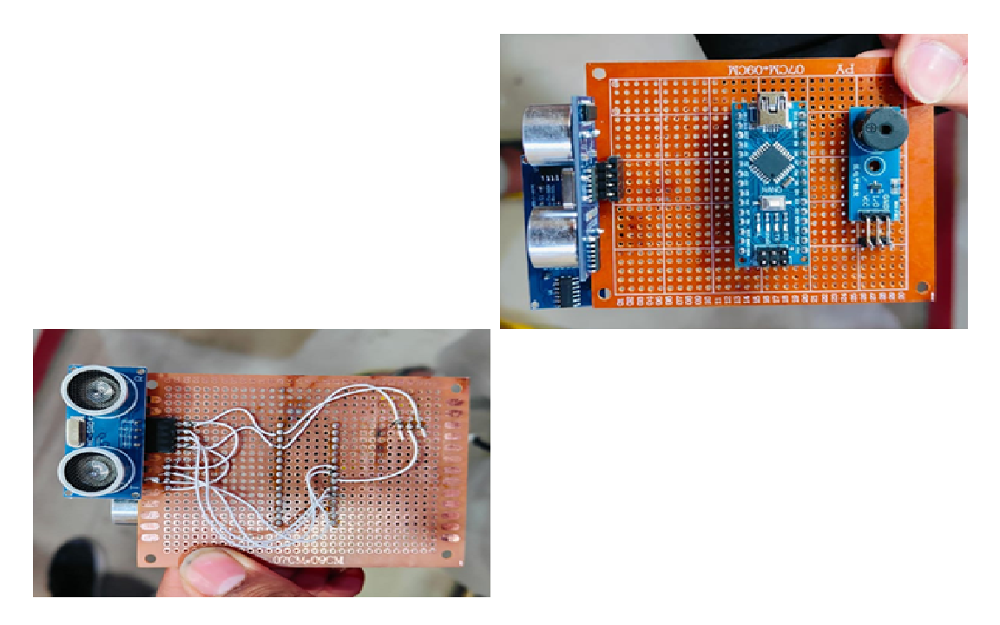
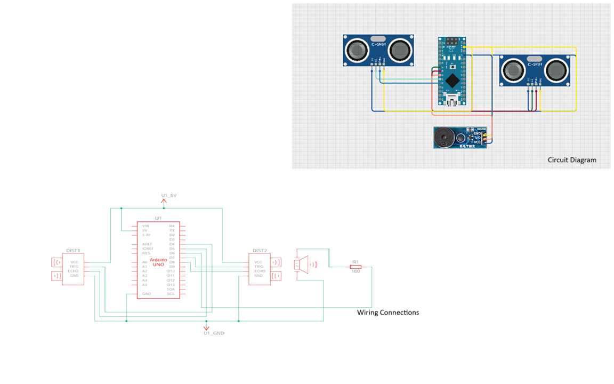

# Blind Assistance Wearable

An Arduino-based assistive device designed to help visually impaired individuals
detect obstacles and elevation changes using ultrasonic sensors.

Features:
- Forward obstacle detection
- Stair / pothole detection
- Audio alerts via buzzer

## Prototype

## Circuit Diagram

